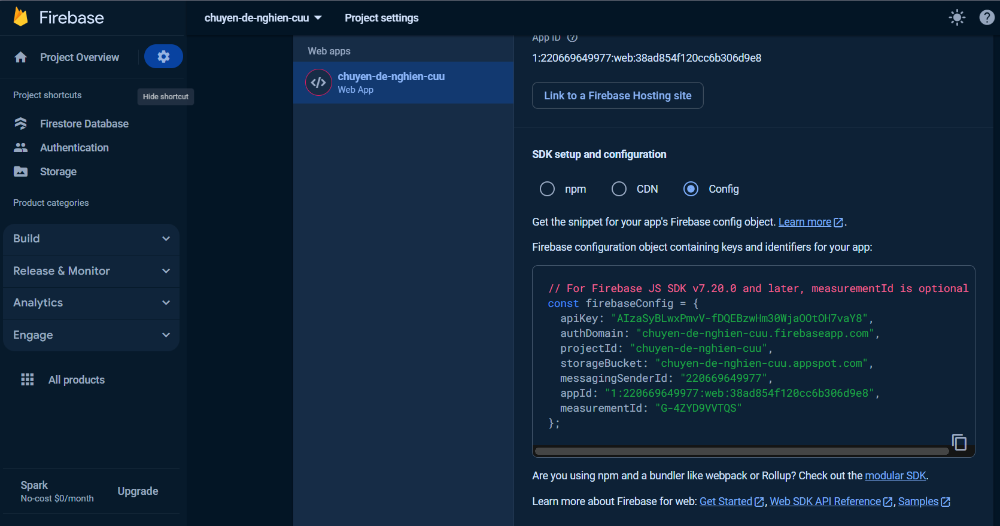
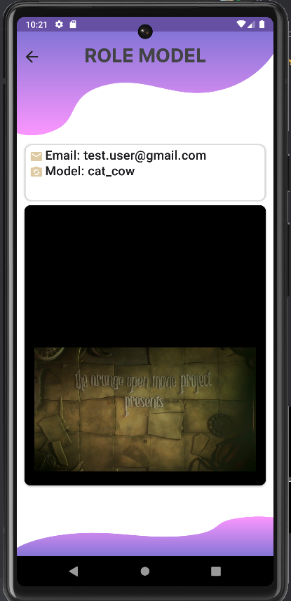

# IT_Project
# Set up
Install libraries: <code>pip install -r requirements.txt</code>.

Go to: **Project settings > Service accounts > Generate new private key.**  
https://console.firebase.google.com/u/0/project/[PROJECT-NAME]/settings/serviceaccounts/adminsdk  

Rename *.json to *key.json* and save in folder *backend*.

Also, add "Web app" in **Project settings > General**. 

Save firebaseConfig as *config.json* in folder *backend*. 

In config.py, replace your compatible keys.

# Run app
On cmd: <code> py app.py </code>  
Access: http://127.0.0.1:5000/

# API Endpoints
| Resource            | Method | URI                                           | Input                                                                                                           | Output                                                                                      |
|---------------------|--------|-----------------------------------------------|-----------------------------------------------------------------------------------------------------------------|---------------------------------------------------------------------------------------------|
| Sign Up             | POST   | `/accounts:signUp?key=[API_KEY]`              | json of Email, Password                                                                                         | User ID, Email, Token                                                                       |
| Sign In             | POST   | `/accounts:signInWithPassword?key=[API_KEY]`  | json of Email, Password                                                                                         | User ID, Email, Token                                                                       |
| Create Model        | POST   | `/api/models/`                                | json of model_id (str), user_id (str), model_name (str), classes (list of str), crawl_number (int), token (str) | JSON of new model instance                                                                  |
| List Models         | GET    | `/api/models/`                                |                                                                                                                 | JSON of all model instances of a user                                                       |
| Model Details       | GET    | `/api/models/{model_id}`                      |                                                                                                                 | Existing model instance details                                                             |
| Delete Model        | DELETE | `/api/models/{model_id}`                      |                                                                                                                 | Confirmation of model instance deletion                                                     |
| Upload Model Images | POST   | `/api/models/{model_id}/images`               | data-form of images (.jpg, .png, etc)                                                                           | JSON including updated model instance with `img_urls`                                       |
| Model Video Process | POST   | `/api/models/{model_id}/videos`               | json of url (str), video (str), token (str)                                                                     | JSON including video processing result and new model instance                               |
| Train YOLO Model    | POST   | `/api/yolo/`                                  | json of model_id (str), token (str)                                                                             | Confirmation message or error if model not found or lacks parameters                        |

# Running android:
1. Open android studio
2. Open the project
3. Run the project
4. Login, or sign up

5. Allow notification access
6. Choose function to use for the model

7. Input the list of objects name

8. Enter the model's name
9. (Optional) Take the object's picture

10. Wait for the notification
11. Get back to the home screen
12. Click on the model you just trained (It should have status 1)

13. Await it to train finish, it will pop notification when it's done
14. Click on the model again
15. Input the video

16. Then click "START CALCULATE"
17. Wait for the result, it will pop notification when it's done

18. Click Check on the notification to see the video with the result

